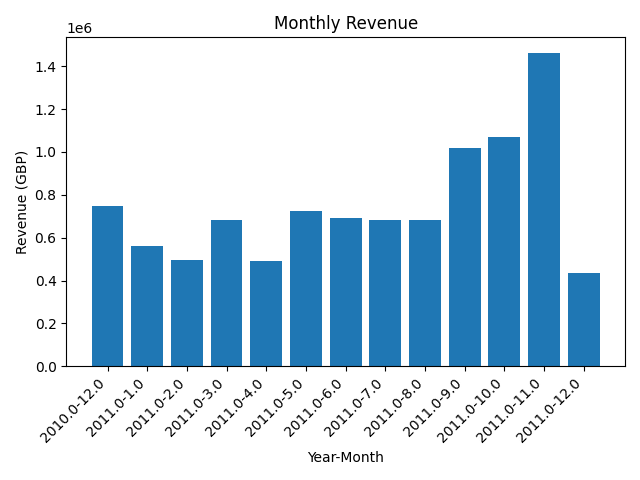
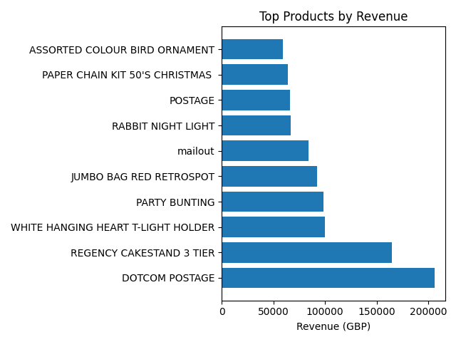

# E‑Commerce Sales Analytics Pipeline

A complete end‑to‑end data engineering project showcasing a classic **Extract → Transform → Load (ETL)** pipeline, followed by analytics and visualization. Built with Python, PostgreSQL, and VS Code, this project demonstrates real‑world skills in data ingestion, modeling, SQL analysis, and reporting.

---

## 🚀 Project Overview

An online retailer’s raw transaction log (from the UCI Online Retail dataset) is:

1. **Extracted** from an Excel file into a clean Parquet staging table.
2. **Transformed** into a star-schema of dimension tables (`dim_customers`, `dim_products`, `dim_date`) and a fact table (`fact_orders`).
3. **Loaded** into a local PostgreSQL database for efficient querying.
4. **Analyzed** via SQL queries and Python, producing key insights like monthly revenue trends and top-selling products.
5. **Visualized** in both Jupyter notebooks and standalone scripts, generating clear, customizable charts.

This repo provides both an **interactive notebook** for exploration and **production-ready scripts** for automation.

---

## 🔧 Tech Stack

* **Language:** Python 3.8+
* **Database:** PostgreSQL (local)
* **Libraries:** pandas, SQLAlchemy, psycopg2, PyYAML, matplotlib, Flask (optional), ipykernel
* **IDE:** VS Code (with Python & SQL extensions)

---

## 📁 Repository Structure

```
├── .gitignore
├── README.md                   ← this file
├── config.yaml                ← connection & path settings
├── data/
│   ├── raw/                   ← original `Online Retail.xlsx`
│   ├── processed/
│   │   ├── orders_staging.parquet     ← extract output
│   │   └── transformed/               ← star-schema Parquet tables
│   └── sample/                ← optional small CSV samples
├── etl/
│   ├── extract.py             ← reads Excel → Parquet
│   ├── transform.py           ← builds dims & fact
│   └── load.py                ← writes Parquet → Postgres
├── notebooks/
│   └── analytics/
│       └── analysis.ipynb     ← interactive SQL & charts
├── scripts/
│   └── analysis/
│       ├── analytics.py       ← standalone SQL queries
│       └── visualization.py   ← chart generation scripts
├── output/                    ← generated PNG charts
└── requirements.txt
```

---

## 🔍 Getting Started

1. **Clone the repo**:

   ```bash
   git clone https://github.com/your-user/ecommerce-sales-analytics.git
   cd ecommerce-sales-analytics
   ```

2. **Create a virtual environment & install dependencies**:

   ```bash
   python3 -m venv venv
   source venv/bin/activate        # (or .\venv\Scripts\activate on Windows)
   pip install -r requirements.txt
   ```

3. **Configure your database**:

   * Install PostgreSQL locally.
   * Create a database & user (`ecommerce`) and grant privileges.
   * Update `config.yaml` with your host, port, user, password, and database name.

4. **Run the ETL pipeline**:

   ```bash
   python etl/extract.py
   python etl/transform.py
   python etl/load.py
   ```

5. **Explore interactively**:

   * Open the notebook `notebooks/analytics/analysis.ipynb`.
   * Select the `venv` kernel in VS Code and **Run All** cells to see queries and inline charts.

6. **Or run scripts**:

   ```bash
   python scripts/analysis/analytics.py
   python scripts/analysis/visualization.py
   ```

   Generated charts will save to `output/` as `monthly_revenue.png` and `top_products.png`.

---

## 📊 Sample Outputs

**Monthly Revenue Trend**



**Top 10 Products by Revenue**



*(More visuals available in the notebook — feel free to customize colors, labels, and add new KPIs!)*

---

## 🌟 Why This Project

* **Complete workflow:** demonstrates all phases of data engineering.
* **Real-world dataset:** hands-on with messy, mixed-type data.
* **Best practices:** config-driven, logging, modular scripts, and clear folder structure.
* **Dual interface:** interactive notebooks for exploration and scripts for production.

Whether you’re interviewing, building your portfolio, or sharpening your ETL skills, this project has it all. Clone, customize, and extend!
